### STEP 1 INSTALLING THE NGINX WEB SERVER
> SSH into EC2 instance

> Update server's package index and install NGINX

       sudo apt update
       sudo apt install nginx
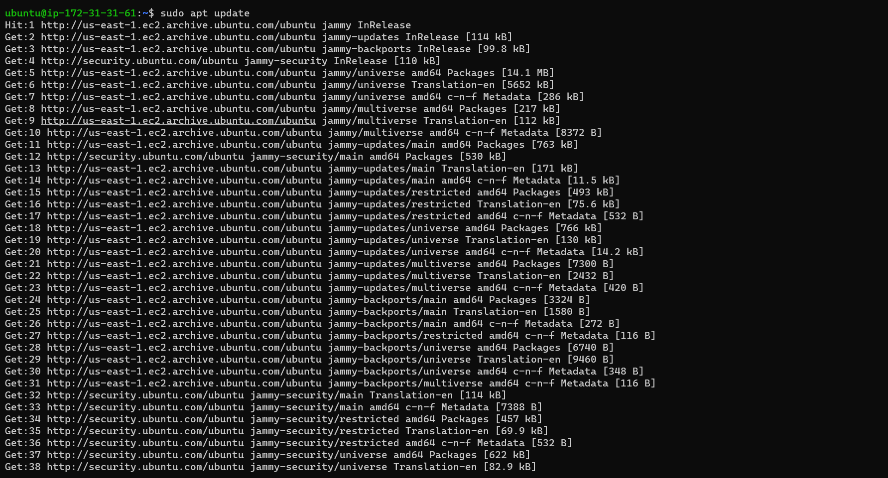
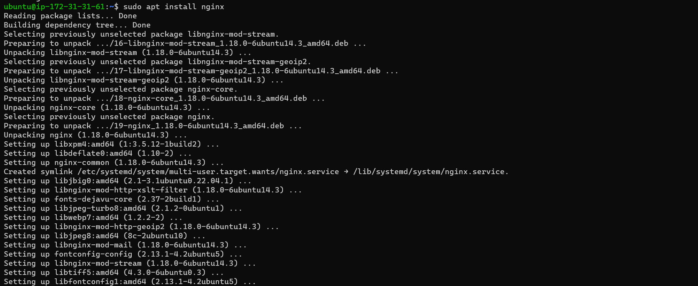

> Confirm the web server is successully installed

        sudo systemctl status nginx
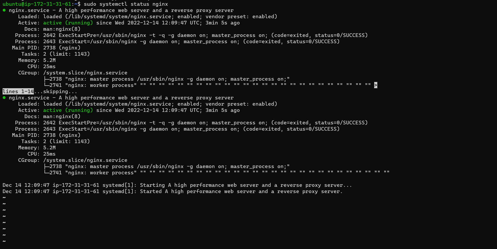

> Add rule to EC2 configuration to open inbound connection through port 80
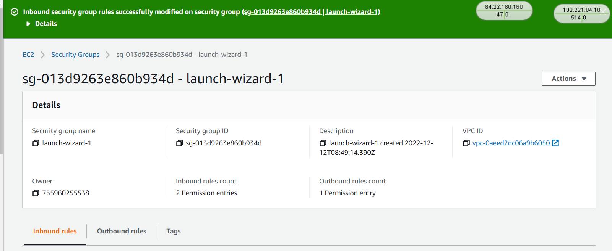

> Accessing server locally in Ubuntu shell and from the internet using DNS address or IP address

      curl http://localhost:80
      or
      curl http://127.0.0.1:80
      http://<Public-IP-Address>:80 -from the internet
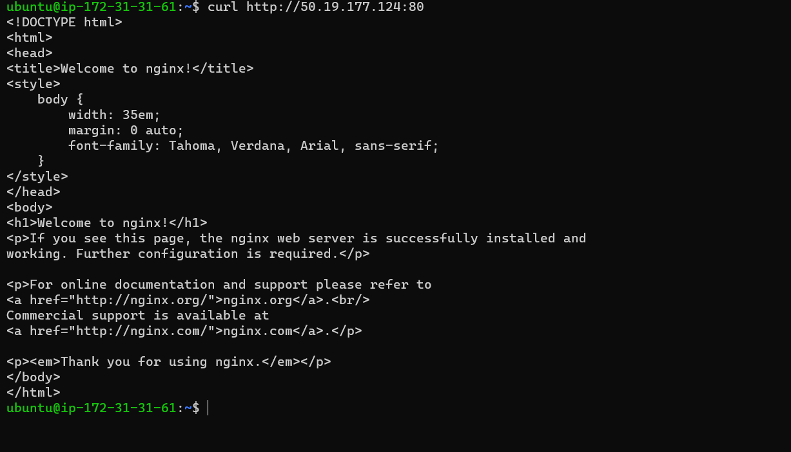

> Command to retrieve for public address without accessing AWS console

       curl -s http://169.254.169.254/latest/meta-data/public-ipv4
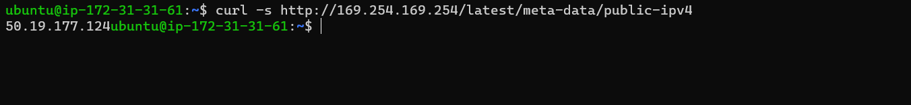

### STEP 3 INSTALLING MYSQL
> Install a MySQL server

      sudo apt install mysql-server
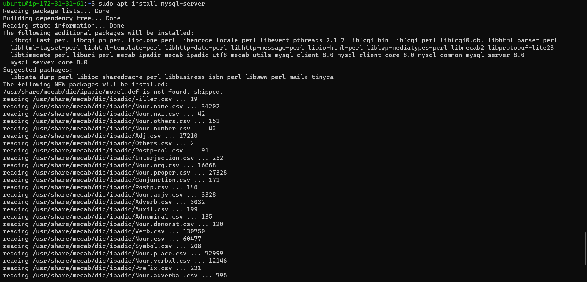
> Log into the server

      sudo mysql
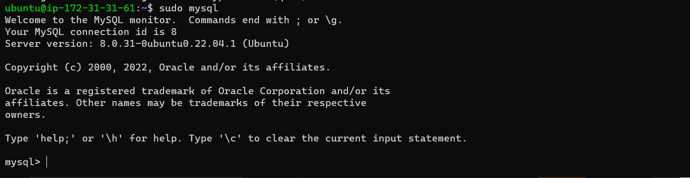
> Set a password for the root user

        ALTER USER 'root'@'localhost' IDENTIFIED WITH mysql_native_password BY 'PassWord.1';
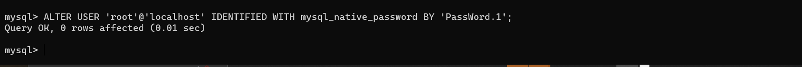
> Exit mysql

    mysql> exit

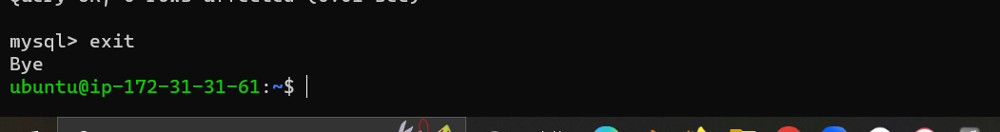

> Start an interactive script 

    sudo mysql_secure_installation
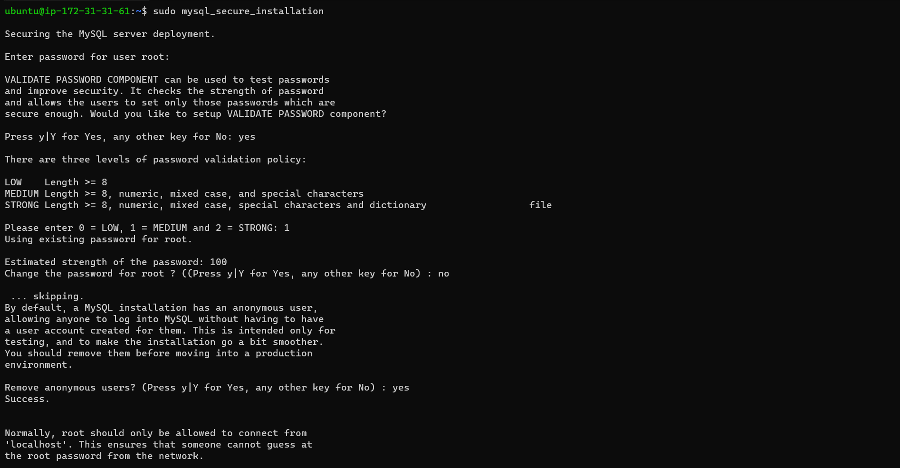

>Log into mysql with password prompt

      sudo mysql -p

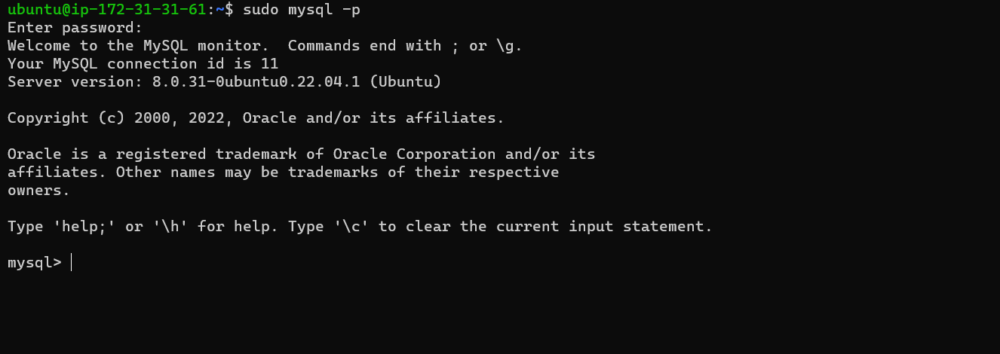

> Exit mysql

     mysql> exit

### STEP 3 INSTALLING PHP
> Installation packages of PHP on NGINX

     sudo apt install php-fpm php-mysql
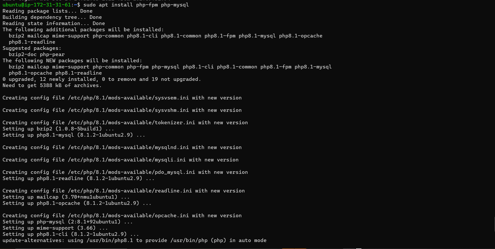
>PHP successfully installed

### STEP 4 CONFIGURING NGINX TO USE PHP PROCESSOR
> Create root web directory for domain name projectLEMP

      sudo mkdir /var/www/projectLEMP
> Assign ownership of the directory to current system user

      sudo chown -R $USER:$USER /var/www/projectLEMP
> Open new configuration file in Nginx in nano text editor

       sudo nano /etc/nginx/sites-available/projectLEMP
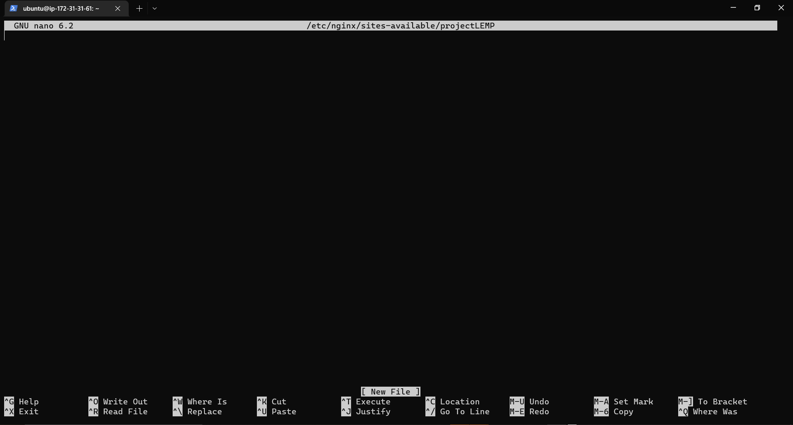
> Paste the following

server {
    listen 80;
    server_name projectLEMP www.projectLEMP;
    root /var/www/projectLEMP;

    index index.html index.htm index.php;

    location / {
        try_files $uri $uri/ =404;
    }

    location ~ \.php$ {
        include snippets/fastcgi-php.conf;
        fastcgi_pass unix:/var/run/php/php8.1-fpm.sock;
     }

    location ~ /\.ht {
        deny all;
    }

}

Save and close the file
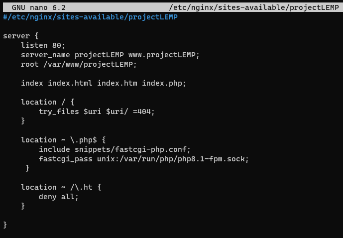

> Activate configuration by linking config file  

    sudo ln -s /etc/nginx/sites-available/projectLEMP /etc/nginx/sites-enabled/
> Test configuration for syntax errors

      sudo nginx -t
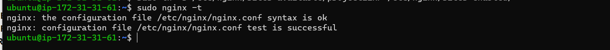

> Disable default Nginx host 

    sudo unlink /etc/nginx/sites-enabled/default
> Reload Nginx to apply changes

      sudo systemctl reload nginx
> Create an index.html file to test the server block works

        sudo echo 'Hello LEMP from hostname' $(curl -s http://169.254.169.254/latest/meta-data/public-hostname) 'with public IP' $(curl -s http://169.254.169.254/latest/meta-data/public-ipv4) > /var/www/projectLEMP/index.html

> Open website URL using IP address

    http://<Public-IP-Address>:80
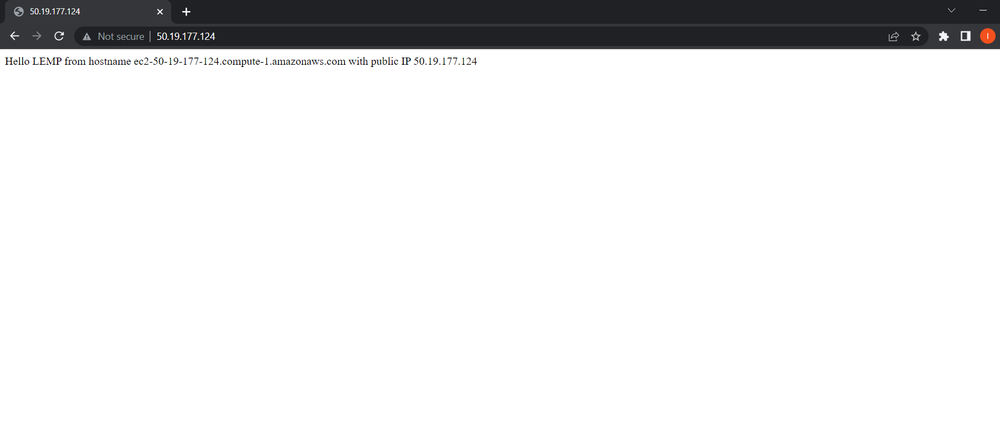

> Open website URL using DNS IP address

     http://<Public-DNS-Name>:80
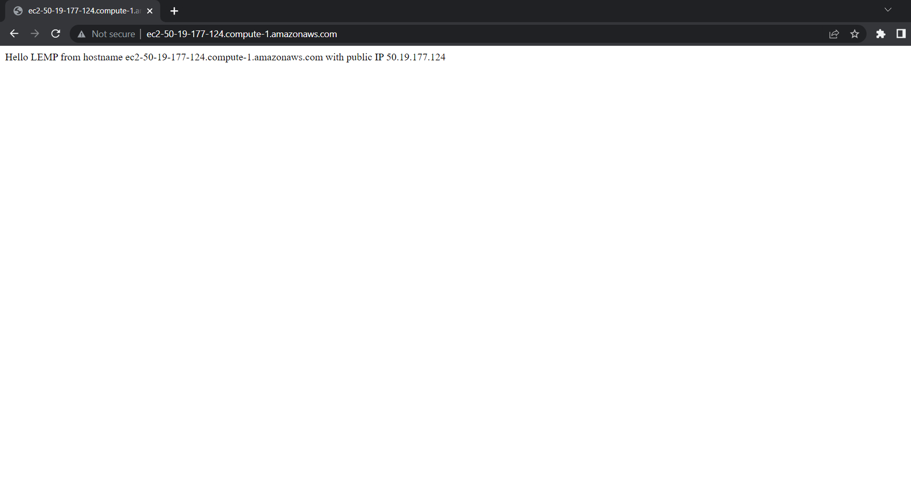

### STEP 5 TESTING PHP WITH NGINX
> Validate Nginx can handle .php files

> Create a test php file in document root

    sudo nano /var/www/projectLEMP/info.php
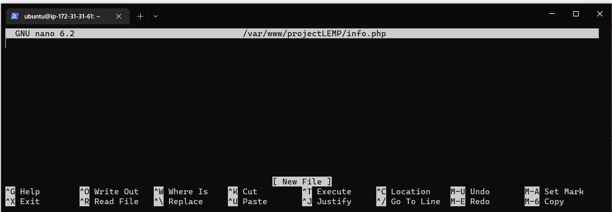
> Paste the codes into the new file and save 

     <?php
     phpinfo();
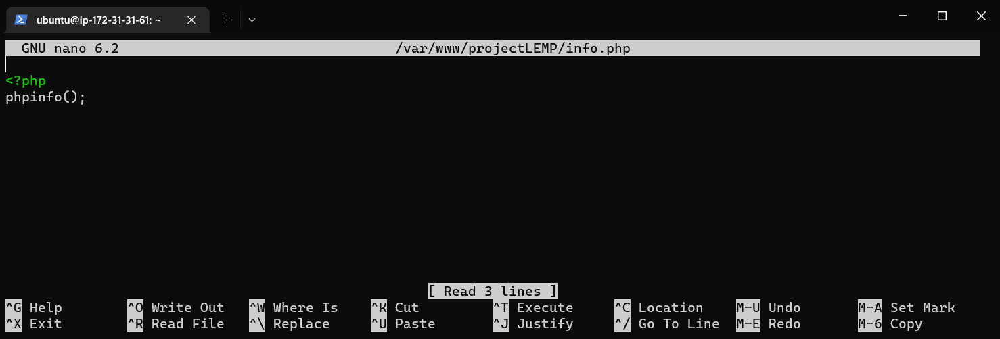
> Access the page in web browser with domain name or IP address 

    http://`server_domain_or_IP`/info.php
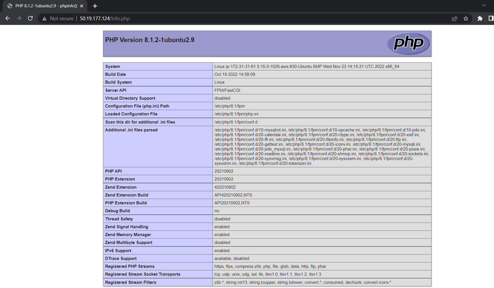

> Remove the file due to it containing sensitive information

      sudo rm /var/projectLEMP/info.php

### STEP 6 RETRIEVING DATA FROM MYSQL DATABASE WITH PHP

> Connect to the MySQL console using the root account

    sudo mysql -p

> Create a database

    mysql> CREATE DATABASE 'example_database';
 
> Create a user and authenticate password

     mysql>  CREATE USER 'example_user'@'%' IDENTIFIED WITH mysql_native_password BY 'password';
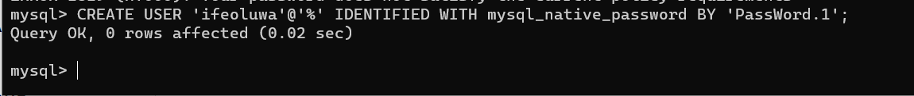
> Grant the user permission to the database

       mysql> GRANT ALL ON example_database.* TO 'example_user'@'%';
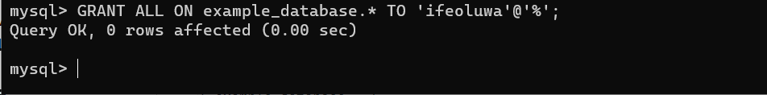
> Exit MySQL
> Confirm the new configuration by logging into mysql using the new user

     mysql -u example_user -p
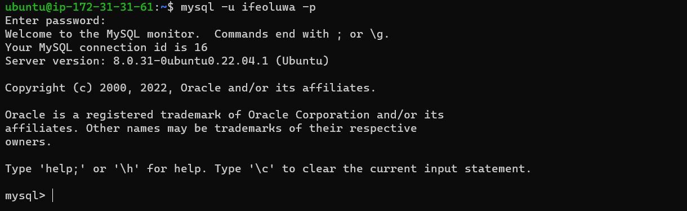
> Check access to database

    mysql> SHOW DATABASES;
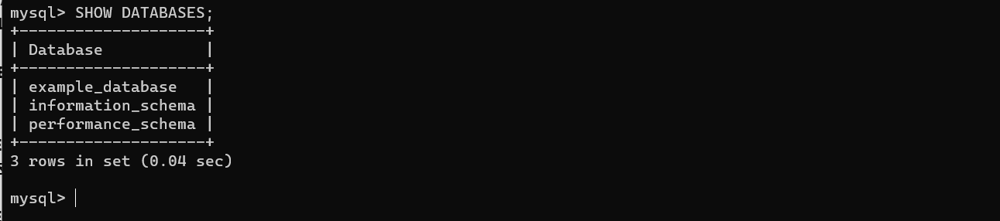

> Create a table named todo_list an input data

    CREATE TABLE example_database.todo_list (
    mysql>     item_id INT AUTO_INCREMENT,
    mysql>     content VARCHAR(255),
    mysql>     PRIMARY KEY(item_id)
    mysql> );
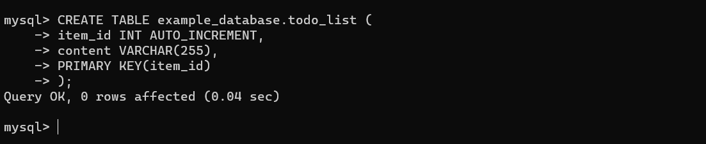
> Insert a few rows of content into table

    mysql> INSERT INTO example_database.todo_list (content) VALUES ("My first important item");
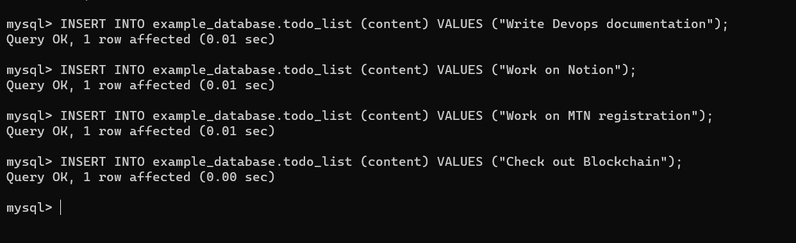
> Confirm data has successfully saved

      mysql>  SELECT * FROM example_database.todo_list;
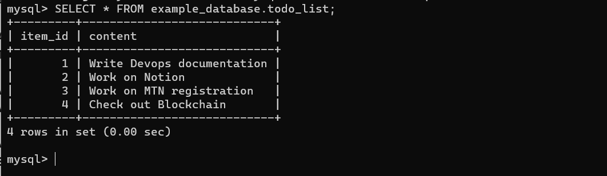
> Exit

> Create a PHP file in web root directory 

    nano /var/www/projectLEMP/todo_list.php
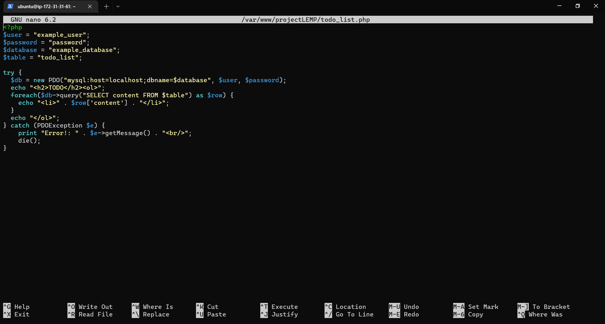
> Save and close file
> Access the page on a web browser

      http://<Public_domain_or_IP>/todo_list.php
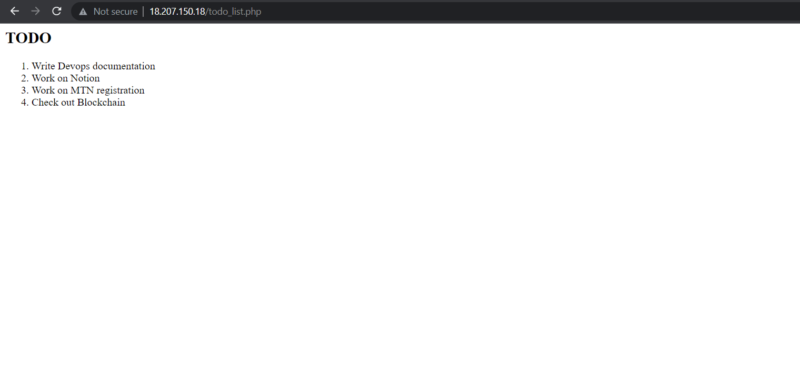

      